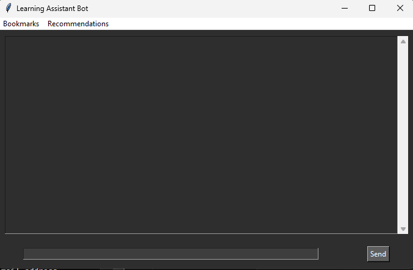

# Learning Assistant Bot

Learning Assistant Bot is a Python-based chatbot that fetches learning resources from the web to help users learn various topics. It takes commands from a GUI and responds like a chatting app, suggesting books, resources, and famous YouTube videos based on the user's input.

## Features

- **Fetch Learning Resources**: Fetch top learning resources from Google search results based on user queries.
- **Dark Themed GUI**: A visually appealing dark-themed user interface.
- **Resource Categorization**: Categorizes fetched resources into articles, videos, books, and others for better organization.
- **Bookmarking System**: Allows users to bookmark resources for later reference, with bookmarks saved in a JSON file.
- **Recommendation Engine**: Suggests similar resources based on user interactions.

## Installation

1. Clone the repository:
    ```bash
    git clone https://github.com/yourusername/Learning-Assistant-Bot.git
    cd Learning-Assistant-Bot
    ```

2. Install the required Python packages:
    ```bash
    pip install requests beautifulsoup4
    ```

3. Run the bot:
    ```bash
    python main.py
    ```

## Usage

1. Enter a topic you want to learn about in the input field and press `Enter` or click the `Send` button.
2. The bot will fetch and display top resources related to your query.
3. Click on the yellow "Bookmark" link next to any resource to save it for later.
4. Access your bookmarks from the "Bookmarks" menu.
5. Get recommendations based on your interactions from the "Recommendations" menu.

## Screenshot



## License

MIT License

```
MIT License

Permission is hereby granted, free of charge, to any person obtaining a copy
of this software and associated documentation files (the "Software"), to deal
in the Software without restriction, including without limitation the rights
to use, copy, modify, merge, publish, distribute, sublicense, and/or sell
copies of the Software, and to permit persons to whom the Software is
furnished to do so, subject to the following conditions:

The above copyright notice and this permission notice shall be included in all
copies or substantial portions of the Software.

THE SOFTWARE IS PROVIDED "AS IS", WITHOUT WARRANTY OF ANY KIND, EXPRESS OR
IMPLIED, INCLUDING BUT NOT LIMITED TO THE WARRANTIES OF MERCHANTABILITY,
FITNESS FOR A PARTICULAR PURPOSE AND NONINFRINGEMENT. IN NO EVENT SHALL THE
AUTHORS OR COPYRIGHT HOLDERS BE LIABLE FOR ANY CLAIM, DAMAGES OR OTHER
LIABILITY, WHETHER IN AN ACTION OF CONTRACT, TORT OR OTHERWISE, ARISING FROM,
OUT OF OR IN CONNECTION WITH THE SOFTWARE OR THE USE OR OTHER DEALINGS IN THE
SOFTWARE.
